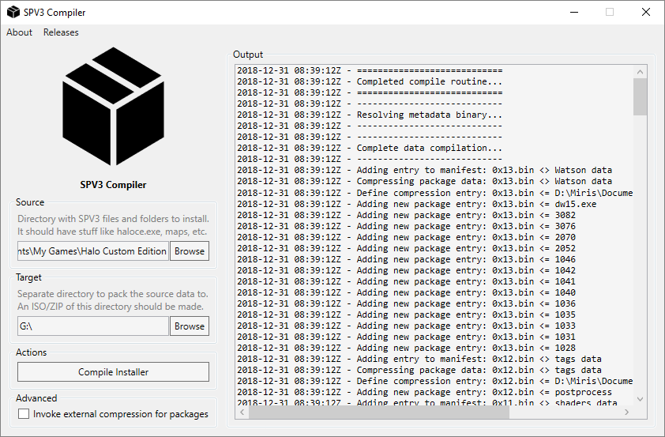

# Compilation Procedure

The SPV3 Compiler's objective is to facilitate the compression of the SPV3 data
into packages. These packages are used by the SPV3 Installer to install the
SPV3 files to the end-user's computer.

- [Usage](#usage)
- [Directories](#directories)
- [Packages](#packages)

## Usage

In the GUI, specify your source & target directory, then click the button and
wait for the compilation to finish. During this time, you might see brief
command lines popping up. Rest assured that this is expected, and nothing tragic
should happen!

## Directories

The GUI expects you to specify two directories:

**Source**: In a nutshell, the directory you choose will end up being what the
SPV3 Installer will end up installing to the end-user's system.
  
This directory should contain the HCE & SPV3 data. In this context, data refers
to the HCE executable, OS libraries, SPV3 maps and equivalent files.
          
**Target**: The installation packages will be created in this directory. No
special requirements here!

Ideally, it should be a directory that will be distributed as an ISO/ZIP. With
this in mind, it should only contain SPV3-related installation files (the
installer & packages), and documents such as a changelog and readme.

Fundamentally, the Compiler handles two tasks:

- creating DEFLATE packages of the source directory's files & subdirectories.
- creating a Manifest (`0x00.bin`) which represents the source directory.

## Packages

To comply with the [Specification](specification.md) document, the compiler
produces DEFLATE binary packages with the following convention:

- for all of the root files, a single "core" package is created: `0x01.bin`;
- for each subdirectory, a package is created; starting at `0x02.bin`.

