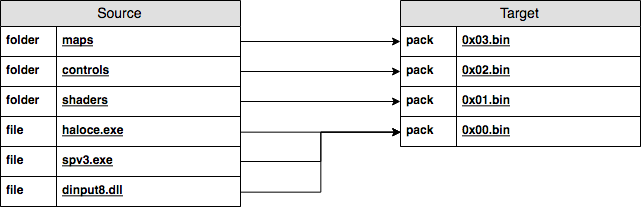

<html>
    <p align="center">
        
    </p>
    <h1 align="center">
        SPV3.Installer
    </h1>
    <h3 align="center">
        Source for the SPV3 installer & compiler
    </h3>
</html>

# Introduction

- [Introduction](#introduction)
- [Compiler](#compiler)
  - [Usage](#usage)
  - [GUI](#gui)
  - [CLI](#cli)
  - [Directories](#directories)
- [Entities](#entities)
  - [Manifest](#manifest)
  - [Package](#package)
  - [Entry](#entry)
- [Work flow](#work-flow)
  - [Compile](#compile)
  - [Install](#install)
  - [Release](#release)

The SPV3.Installer project is designed to be a flexible and reliable successor
to the original SPV3 installer.

This repository contains the source code and specification for the SPV3.2
compiler & installer.

The installer's objective is to:

1. back up of any SPV3 data that may already exist on the file system; and
2. extract the SPV3 packages to the directory specified by the user.

Read on for further information on compiling, the domain entities and how to use
the installer & compiler.

# Compiler

The SPV3.Compiler's objective is to facilitate the compression of the SPV3 data
into packages, and to generate a manifest file for the packages.

These packages are used by the SPV3 Installer to install the SPV3 files to the
end-user's computer.

## Usage

The Compiler can be interacted with using a GUI or a CLI.

## GUI


In the GUI, specify your source & target directory, then click the button and
wait for the compilation to finish. During this time, you might see brief
command lines popping up. Rest assured that this is expected, and nothing tragic
should happen!

## CLI

Invoke the SPV3.Compiler.CLI.exe from PowerShell/Command Line like so:

```
.\SPV3.Compiler.CLI.exe "path\to\source" "path\to\target"
```

In Linux shells like Bash, Zsh, etc., swap the backslashes with forward slashes.

## Directories

The compiler deals with two directories:

**Source**: In a nutshell, the directory you choose will end up being what the
SPV3 Installer will end up installing to the end-user's system.
  
This directory should contain the HCE & SPV3 data. In this context, data refers
to the HCE executable, OS libraries, SPV3 maps and equivalent files.
          
**Target**: The installation packages will be created in this directory. No
special requirements here!

Ideally, it should be a directory that will be distributed as an ISO/ZIP. With
this in mind, it should only contain SPV3-related installation files (the
installer & packages), and documents such as a changelog and readme.

# Entities


## Manifest

A manifest file is a persistent representation of all the packages that the SPV3
Installer should handle. The manifest is called `0x00.bin` on the filesystem,
and its contents are a DEFLATE-compressed XML representation of a Manifest-type
instance. 

## Package

A package is a DEFLATE archive with the SPV3 data that should be installed. They
are identified by the `0x` prefix, and the `.bin` extension. 

The compiler & installer distinguishes the core from the data packages.

The core package contains all of the main HCE/SPV3 files, such as the game
executable, configuration files, and libraries. On the filesystem, this package
is conventionally known as `0x01.bin`.

The data packages each represent a HCE/SPV3 subdirectory. Subdirectories include
`content`, `controls` and `maps`. What distinguishes these packages from the
core one is:

1. Each package has a `Directory` attribute defined in the manifest. This value
   represents the subdirectory the package should have its data extracted to.  
2. The names are numeric increments: `0x02.bin` ... `0x05.bin` ... `0x10.bin`.



## Entry

An Entry is a member of the Package entity. It is effectively a file in the
archive on the filesystem. Entries are comprised of:

- Name: The identifier of the entry, which matches the file/directory it
  represents.
- Type: The kind of filesystem record (i.e. file or directory) the entry
  represents.

Entries are used by the  library to determine which files should be backed up
prior to installing SPV3.

# Work flow

This section covers the work flow the SPV3 team should follow when using the
compiler & installer in development/testing contexts.

## Compile

1. Grab the Compiler GUI from the GitHub release page. Extract & run it!
2. Pick a SPV3/HCE folder (should have `haloce.exe`, `maps`, etc.) for `Source`.
3. Pick a folder for `Target`. When you Compile, the packages will go here.

## Install

1. Move the GUI to the `Target` folder you specified earlier.
   In other words, put the executable along those `0x0.bin` files.
2. Run the GUI, choose a path to install SPV3/HCE to (should be a blank folder).
3. Click Install. The SPV3/HCE files will be installed to the the Target folder.

## Release

1. Have the installer GUI & packages in the same folder.
2. Make a ZIP/ISO of that folder, then upload it on some sweet websites.

Users will only have to run the Installer, choose a target & click Install, just
like the old installer.